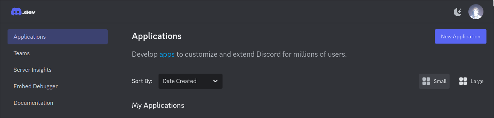
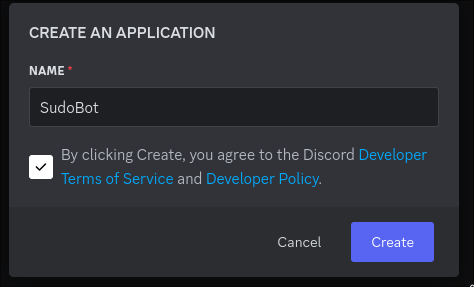
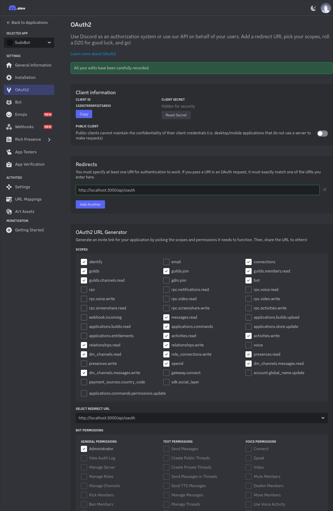
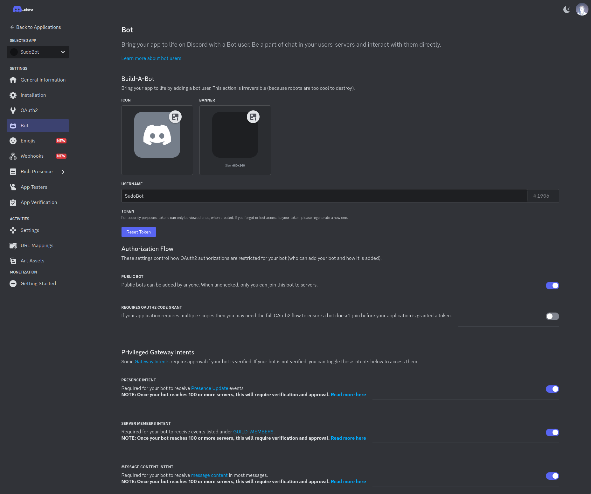

# nap-and-go


My way to learn Go by creating a Discord bot with a bunch of features

## Features

- Connects to its own database
- Connects to discord
- Replies to a message when it is sent a message in a channel

Features will be added as they get completed

## Usage

The application is designed to be run in a collection of containers with Postgres.

```
docker compose up -d
docker compose logs -f
```

## Create a Discord application and Bot

- Go to the [Discord Developer portal](https://discord.com/developers/applications)
- Click the *New Application* button at the top right
    
- Give the application a name
    
- Click the OAuth menu item and configure the a redirect URI. Don't forget to save the page!
    - For development http://localhost:3000/api/oauth
    - For production https://YOURSERVER/api/oauth
    
- Click the *Reset Secret* button and copy the new secret that you are given. This will become DISCORD_CLIENT_SECRET in your environment file
- Copy the Client ID - this will become DISCORD_CLIENT_ID in your environment file.
- Click the Bot menu item, and configure the bot settings (you will need to enable several Intents as noted below)
    
- Click the *Reset Token* button and copy the new token that you receive. This will become your DISCORD_BOT_TOKEN environment variable.

## Installation

- Create an .env file using the .env-prod-example as a template
- Enter your values for DISCORD_CLIENT_ID, DISCORD_CLIENT_SECRET and DISCORD_BOT_TOKEN from the above procedure.

## Development Notes

### Project layout

- cmd/bot -- stuff for the bot
- cmd/web -- stuff for the web UI
- config -- handles configuration (mainly loading by environment variables)
- db -- stuff for the database
- docs -- additional documentation
- models -- database models
- static -- web UI static files
- templates -- web UI templates
- discordtypes -- structs used by db and discordapi to populate data
- discordapi -- functions that do useful things with the discord REST API

